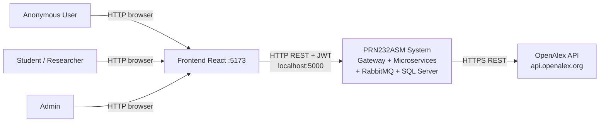
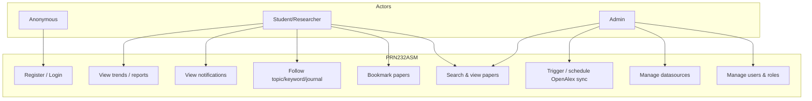
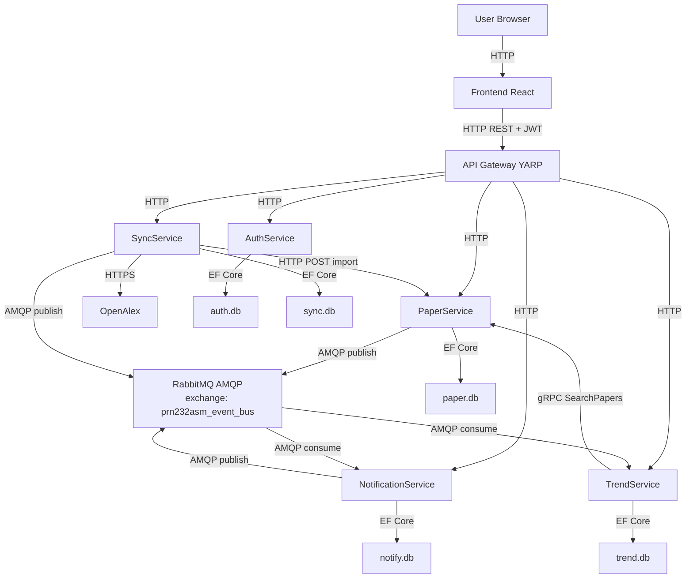
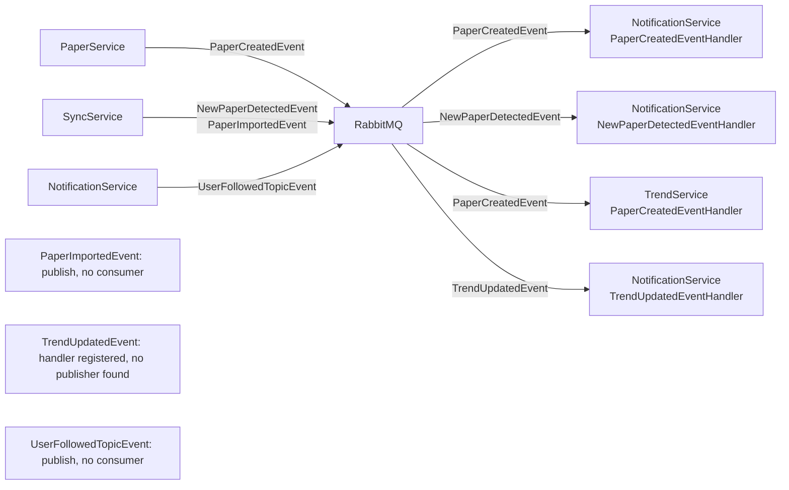
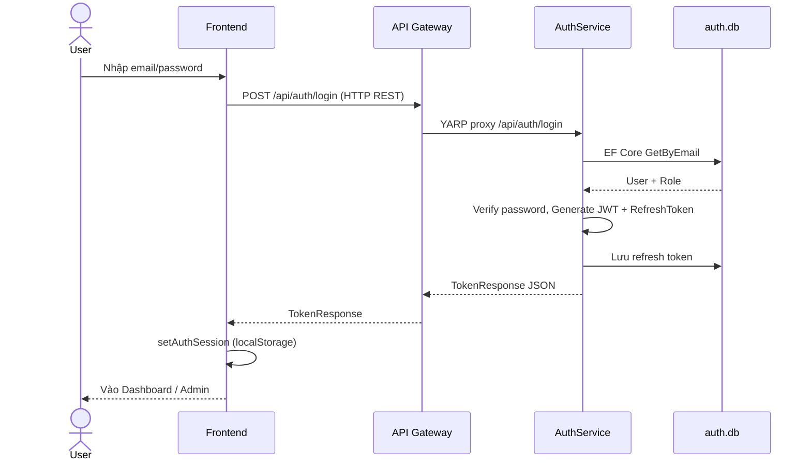
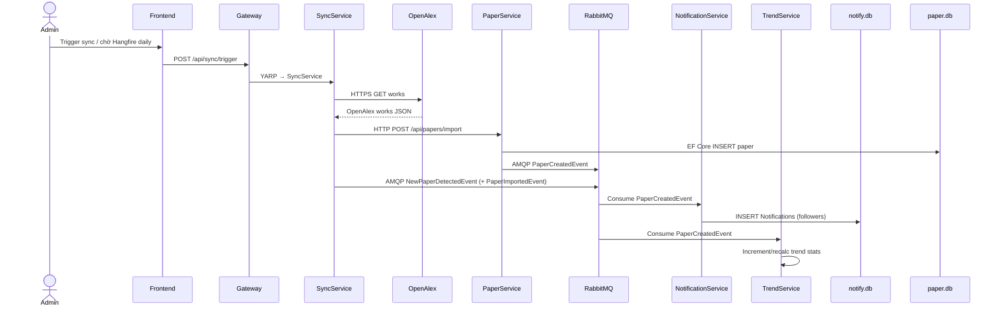
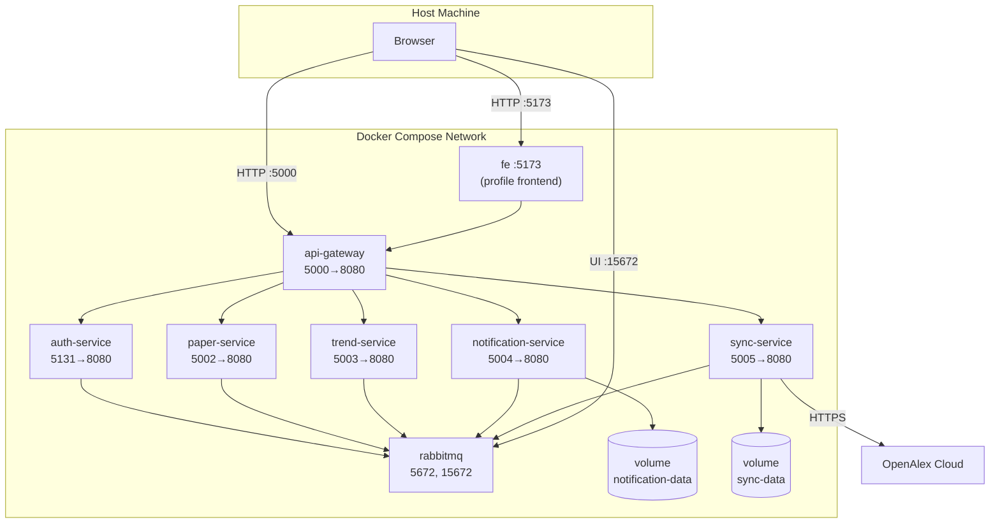

# Mô tả kiến trúc hệ thống Microservices — PRN232ASM

> Tài liệu đối chiếu trực tiếp với mã nguồn và cấu hình triển khai thực tế (`docker/docker-compose.yml`, YARP, Controllers, EventBus).

Hệ thống **PRN232ASM** là nền tảng theo dõi xu hướng nghiên cứu khoa học: người dùng tìm kiếm/bookmark paper, follow topic/keyword/journal, nhận thông báo, xem trend/report; Admin quản trị user, datasource và đồng bộ dữ liệu từ OpenAlex.

---

# 1. System Context View

## 1.1. Mô tả (Description)

Hệ thống phục vụ các đối tượng người dùng nội bộ (Anonymous, Student/Researcher, Admin) thông qua ứng dụng web React. Người dùng **không gọi thẳng** microservice; mọi request API đi qua **API Gateway (YARP)**.

Phạm vi hệ thống gồm: Frontend, API Gateway, 5 microservice nghiệp vụ, message broker RabbitMQ, và SQL Server (database tách theo service) trên Docker. Hệ thống bên ngoài chính là **OpenAlex API** (đồng bộ công bố khoa học). RabbitMQ là hạ tầng messaging nằm trong biên giới triển khai Docker nhưng là thành phần phụ trợ (infrastructure), không phải actor người dùng.

## 1.2. Danh sách Actors

| Actor | Mô tả | Cách truy cập |
|-------|--------|----------------|
| **Anonymous User** | Chưa đăng nhập | Landing `/`, Login, Register |
| **Student / Researcher** | Người dùng đã xác thực (role `Student` hoặc `Researcher`) | App routes: dashboard, search, papers, bookmarks, notifications, trends, reports, profile |
| **Admin** | Quản trị hệ thống (role `Admin`) | Thêm `/admin/*`: users, journals, topics, datasources, sync, monitoring, reports |

**Minh chứng role (domain):**

```csharp
// be/Services/AuthService/AuthService.Domain/Entities/Role.cs
// Constants: Admin, Researcher, Student
```

Register mặc định gán role **Student**. FE phân quyền Admin qua `user?.role === 'Admin'` (`fe/src/context/AuthContext.jsx`, `AdminRoute`).

## 1.3. Danh sách External Systems

| Hệ thống ngoài | Mục đích | Protocol |
|----------------|----------|----------|
| **OpenAlex API** (`https://api.openalex.org`) | Lấy danh sách works để import paper | HTTPS REST |
| **SQL Server (Docker)** | Database-per-service (`AuthDb`, `PaperDb`, …) | `1433` |

**RabbitMQ** triển khai cùng Docker Compose (port `5672` / UI `15672`) — thuộc hạ tầng nội bộ, không phải hệ thống nghiệp vụ bên ngoài.

## 1.4. Context Diagram



```
┌─────────────┐   ┌──────────────────┐   ┌─────────────┐
│ Anonymous   │   │ Student/         │   │   Admin     │
│ User        │   │ Researcher       │   │             │
└──────┬──────┘   └────────┬─────────┘   └──────┬──────┘
       │                   │                    │
       └───────────────────┼────────────────────┘
                           │ HTTP
                           ▼
                 ┌───────────────────┐
                 │  Frontend (React) │
                 │     :5173         │
                 └─────────┬─────────┘
                           │ HTTP REST + JWT
                           ▼
       ┌───────────────────────────────────────┐
       │         PRN232ASM (System)            │
       │  API Gateway · Auth · Paper · Trend   │
       │  Notification · Sync · RabbitMQ · DB  │
       └───────────────────┬───────────────────┘
                           │ HTTPS
                           ▼
                 ┌───────────────────┐
                 │    OpenAlex API   │
                 └───────────────────┘
```

## 1.5. Phạm vi hệ thống (System Boundary)

| Thành phần trong phạm vi | Vai trò |
|--------------------------|---------|
| Frontend (React/Vite) | UI người dùng |
| API Gateway (YARP) | Điểm vào duy nhất cho API, JWT, reverse proxy |
| AuthService | Đăng ký/đăng nhập, JWT, quản lý user/role |
| PaperService | Paper, author, journal, keyword, topic, bookmark |
| TrendService | Trend, analytics, dashboard, report |
| NotificationService | Notification + follow |
| SyncService | Đồng bộ datasource / OpenAlex |
| RabbitMQ | Message broker (AMQP) |
| SQL Server per service DB | Lưu trữ dữ liệu tách biệt |

## 1.6. Use Case Diagram (tóm tắt)



### Minh chứng Context

| Evidence | Đường dẫn |
|----------|-----------|
| FE entry + API URL | `fe/src/lib/api.js`, `fe/vite.config.js` (port 5173, proxy `/api` → `:5000`) |
| Routes & actors | `fe/src/App.jsx` |
| Gateway routes | `be/Gateway/ApiGateway/Configuration/yarp.json` |
| OpenAlex | `docker/docker-compose.yml` (`OpenAlex__BaseUrl`), `OpenAlexClient.cs` |
| Roles | `AuthService.Domain/Entities/Role.cs` |

---

# 2. Runtime View

## 2.1. Mô tả (Description)

Khi chạy, client gửi **HTTP REST** tới Gateway; Gateway forward tới đúng service. Giữa các service có hai hình thức:

1. **REST (HttpClient)** — gọi đồng bộ khi cần kết quả ngay (Sync → Paper import).
2. **gRPC** — TrendService gọi PaperService để lấy catalog paper khi aggregate trend (`PaperCatalog.SearchPapers`).
3. **Message Queue (RabbitMQ / AMQP)** — publish/consume integration events bất đồng bộ (paper created → notify + cập nhật trend incremental).

API contract public = REST Controllers + Swagger/OpenAPI (Development).  
API contract nội bộ Trend↔Paper = **gRPC `.proto`**.

## 2.2. Service Catalog

| # | Service | Chức năng chính | API prefix chính | Database | Host port |
|---|---------|-----------------|------------------|----------|-----------|
| 0 | **ApiGateway** | YARP reverse proxy, validate JWT, inject `X-User-Id` | `/api/**`, `/health` | — | **5000** |
| 1 | **AuthService** | Register/login, JWT/refresh, quản lý user/role | `/api/auth`, `/api/users` | `auth.db` | **5131** |
| 2 | **PaperService** | CRUD/search/import papers; authors, journals, keywords, topics, bookmarks | `/api/papers`, `/api/authors`, `/api/journals`, `/api/keywords`, `/api/topics`, `/api/bookmarks` | `paper.db` | **5002** |
| 3 | **TrendService** | Trends, analytics, dashboard, reports; aggregate paper stats | `/api/trends`, `/api/analytics`, `/api/dashboard`, `/api/reports` | `trend.db` | **5003** |
| 4 | **NotificationService** | Notifications + follow topic/keyword/journal | `/api/notifications`, `/api/follows` | `notify.db` | **5004** |
| 5 | **SyncService** | Trigger sync, logs/status, datasources; gọi OpenAlex | `/api/sync`, `/api/datasources` | `sync.db` | **5005** |

**Tổng số service nghiệp vụ:** 5 (+ 1 Gateway).

## 2.3. Runtime Architecture Diagram



## 2.4. Communication Matrix

| From → To | Hình thức | Chi tiết |
|-----------|-----------|----------|
| FE → Gateway | **REST** | `VITE_API_URL` = `http://localhost:5000` |
| Gateway → Auth/Paper/Trend/Notification/Sync | **REST** (YARP) | `yarp.json` clusters |
| SyncService → OpenAlex | **REST HTTPS** | `OpenAlexClient` |
| SyncService → PaperService | **REST** | `POST api/papers/import` (`PaperImportClient`) |
| TrendService → PaperService | **gRPC** | `PaperCatalog.SearchPapers` (`paper_catalog.proto`) |
| PaperService → RabbitMQ | **AMQP / Message Queue** | Publish `PaperCreatedEvent` |
| SyncService → RabbitMQ | **AMQP** | Publish `PaperImportedEvent`, `NewPaperDetectedEvent` |
| NotificationService → RabbitMQ | **AMQP** | Publish `UserFollowedTopicEvent` |
| RabbitMQ → NotificationService | **AMQP** | Consume `PaperCreatedEvent`, `NewPaperDetectedEvent`, `TrendUpdatedEvent` |
| RabbitMQ → TrendService | **AMQP** | Consume `PaperCreatedEvent` |
| AuthService ↔ other services | — | Không gọi trực tiếp (chỉ JWT qua Gateway) |

**Không dùng gRPC** cho FE/Gateway. gRPC chỉ dùng nội bộ **TrendService → PaperService**.

## 2.5. Event Flow Diagram



| Event | Publisher | Consumer |
|-------|-----------|----------|
| `PaperCreatedEvent` | PaperService | NotificationService, TrendService |
| `NewPaperDetectedEvent` | SyncService | NotificationService |
| `PaperImportedEvent` | SyncService | *(không có consumer)* |
| `TrendUpdatedEvent` | *(không có publisher)* | NotificationService (đã đăng ký) |
| `UserFollowedTopicEvent` | NotificationService | *(không có consumer)* |
| `NotificationEvent` | — | — |

**Minh chứng EventBus:** `be/BuildingBlocks/EventBus/RabbitMQ/RabbitMqEventBus.cs` — exchange topic, routing key = tên event, payload JSON.

## 2.6. Background Workers

| Worker | Service | Loại | Lịch | Việc làm |
|--------|---------|------|------|----------|
| `CleanupOldNotificationsJob` | NotificationService | `BackgroundService` | mỗi **7 ngày** | Xóa notification đã đọc > **30 ngày** |
| `TrendAggregationJob` (`trend-aggregation`) | TrendService | Hangfire recurring | `0 */6 * * *` (mỗi 6 giờ) + enqueue lúc start | `RecalculateTrendsAsync` |
| `ScheduledSyncJob` (`daily-openalex-sync`) | SyncService | Hangfire recurring | `Cron.Daily` | `TriggerSyncAsync` (OpenAlex) |

Hangfire dashboard: Trend/Sync tại `/hangfire` (Trend yêu cầu JWT Bearer).

## 2.7. Sequence Diagram — Nghiệp vụ 1: Login



**Minh chứng:** `fe/src/services/authService.js`, `AuthController.Login`, `AuthService.LoginAsync`, route `auth-route` trong `yarp.json`.

## 2.8. Sequence Diagram — Nghiệp vụ 2: Sync OpenAlex → Import Paper → Notify



**Minh chứng:** `SyncAppService.RunOpenAlexSyncAsync`, `PaperImportClient`, `PapersController.Import` / `PaperService.CreateAsync` + `PaperEventPublisher`, handlers trong `NotificationService.Application/EventHandlers`, `TrendService.../PaperCreatedEventHandler`.

## 2.9. API Contract (Swagger / OpenAPI)

| Service | Swagger | Ghi chú |
|---------|---------|---------|
| ApiGateway | Có (`AddSwaggerGen` + UI Development) | |
| AuthService | Có | |
| PaperService | Có | |
| TrendService | Có | |
| NotificationService | Có | |
| SyncService | Có | |

Truy cập (khi chạy Development, trực tiếp service hoặc qua port map):  
`http://localhost:<host-port>/swagger`

**Có gRPC** giữa TrendService và PaperService (`be/BuildingBlocks/GrpcContracts/Protos/paper_catalog.proto`).

Client “gần realtime” notifications: **HTTP polling 15s** trên `NotificationsPage` (`POLL_INTERVAL = 15000`) — không dùng SignalR/WebSocket.

### Minh chứng Runtime

| Evidence | Đường dẫn |
|----------|-----------|
| YARP routing | `be/Gateway/ApiGateway/Configuration/yarp.json` |
| Event bus AMQP | `be/BuildingBlocks/EventBus/RabbitMQ/RabbitMqEventBus.cs` |
| Event contracts | `be/BuildingBlocks/Contracts/**` |
| Controllers | `be/Services/*/.../Controllers/*.cs` |
| Hangfire Trend | `TrendService.Api/Program.cs` |
| Hangfire Sync | `SyncService.Api/Program.cs` |
| Cleanup job | `NotificationService.Infrastructure/BackgroundJobs/CleanupOldNotificationsJob.cs` |
| FE poll | `fe/src/pages/app/NotificationsPage.jsx` |

---

# 3. Deployment View

## 3.1. Mô tả (Description)

Toàn bộ backend + RabbitMQ được khởi động bằng **Docker Compose** (`docker/docker-compose.yml`). Frontend có thể chạy Vite local (`:5173`) hoặc container với Compose **profile** `frontend`.

Mỗi microservice chạy trong **container riêng**, lắng nghe nội bộ port **8080**, map ra host theo bảng port bên dưới. Các container giao tiếp qua **Docker default network** của Compose project (DNS name = tên service: `auth-service`, `paper-service`, …).

Database mặc định là **SQL Server** (container `sqlserver`, volume `sqlserver-data`). **Không có Redis** trong compose hiện tại. **Không dùng Kubernetes** trong cấu hình repo này.

## 3.2. Số lượng Containers

| Container | Image/Build | Service chạy bên trong |
|-----------|-------------|-------------------------|
| `prn232asm-rabbitmq` | `rabbitmq:3-management` | RabbitMQ + Management UI |
| `prn232asm-api-gateway` | build Gateway Dockerfile | ApiGateway |
| `prn232asm-auth-service` | build AuthService | AuthService |
| `prn232asm-paper-service` | build PaperService | PaperService |
| `prn232asm-trend-service` | build TrendService | TrendService |
| `prn232asm-notification-service` | build NotificationService | NotificationService |
| `prn232asm-sync-service` | build SyncService | SyncService |
| `prn232asm-fe` *(optional, profile `frontend`)* | build `fe/Dockerfile` | Frontend static/Vite |

**Mặc định (không bật profile frontend):** **7 containers**.  
**Có frontend profile:** **8 containers**.

## 3.3. Deployment Diagram



## 3.4. Port Mapping

| Service | Host → Container | Mục đích |
|---------|------------------|----------|
| api-gateway | **5000 → 8080** | Entry API cho FE |
| auth-service | **5131 → 8080** | Debug/Swagger trực tiếp |
| paper-service | **5002 → 8080** | Debug/Swagger |
| trend-service | **5003 → 8080** | Debug/Swagger / Hangfire |
| notification-service | **5004 → 8080** | Debug/Swagger |
| sync-service | **5005 → 8080** | Debug/Swagger / Hangfire |
| rabbitmq | **5672 → 5672** | AMQP |
| rabbitmq | **15672 → 15672** | Management UI |
| fe (profile) | **5173 → 5173** | UI |

Gateway env trỏ cluster nội bộ:

- `http://auth-service:8080`
- `http://paper-service:8080`
- `http://trend-service:8080`
- `http://notification-service:8080`
- `http://sync-service:8080`

## 3.5. Docker Networks

Compose tạo **một bridge network mặc định** cho project (tên dạng `docker_default` / `<project>_default`). Mọi service resolve lẫn nhau bằng **service name** (`rabbitmq`, `paper-service`, …). Không khai báo custom network riêng trong file hiện tại.

## 3.6. Docker Volumes

| Volume | Gắn vào | Dữ liệu |
|--------|---------|---------|
| `notification-data` | `notification-service:/data` | `notify.db` (`Data Source=/data/notify.db`) |
| `sync-data` | `sync-service:/data` | `sync.db` (`Data Source=/data/sync.db`) |

Toàn bộ service dùng SQL Server; dữ liệu bền vững qua volume `sqlserver-data`.

## 3.7. Database / Broker placement

| Thành phần | Triển khai ở đâu |
|------------|------------------|
| RabbitMQ | Container `rabbitmq` trong Compose |
| Redis | **Không có** |
| SQL Server | Container `sqlserver` + volume `sqlserver-data` |
| Kubernetes | **Không dùng** trong repo này |
| Khởi động | **`docker compose -f docker/docker-compose.yml up`** |

## 3.8. Docker Compose Architecture (tóm tắt phụ thuộc)

```
rabbitmq (healthy)
    ├── auth-service
    ├── paper-service
    │       ├── trend-service (depends paper + rabbitmq)
    │       └── sync-service (depends paper + rabbitmq)
    ├── notification-service
    └── (all above)
            └── api-gateway
                    └── fe (profile frontend, depends api-gateway)
```

### Minh chứng Deployment

| Evidence | Đường dẫn |
|----------|-----------|
| Compose đầy đủ | `docker/docker-compose.yml` |
| Dockerfiles | `be/Gateway/ApiGateway/Dockerfile`, `be/Services/*/.../Dockerfile`, `fe/Dockerfile` |
| Chụp minh chứng khi demo | Chạy `docker compose -f docker/docker-compose.yml ps` hoặc Docker Desktop |

Lệnh gợi ý lấy evidence screenshot:

```bash
cd docker
docker compose ps
docker compose up -d
# FE optional:
docker compose --profile frontend up -d
```

---

# Phụ lục — Checklist đối chiếu đề bài

| Yêu cầu | Có trong tài liệu? | Minh chứng chính |
|---------|--------------------|------------------|
| Context Diagram + Actors + External | ✔ | Mục 1 |
| Service Catalog | ✔ | Mục 2.2 |
| Runtime Diagram + Communication Matrix | ✔ | Mục 2.3–2.4 |
| ≥ 2 Sequence Diagrams | ✔ | Login + Sync/Import/Notify |
| Event / Publisher-Consumer | ✔ | Mục 2.5 |
| Background Workers | ✔ | Mục 2.6 |
| Swagger + gRPC `.proto` | ✔ | Mục 2.9; `GrpcContracts/Protos/paper_catalog.proto` |
| Deployment Diagram + Compose + Ports + Volumes + Network | ✔ | Mục 3 |
| Khớp source | ✔ | Path file trong từng mục Evidence |

---

*Tài liệu sinh từ mã nguồn PRN232ASM — cập nhật theo `docker-compose.yml` và Controllers/EventBus hiện có.*
